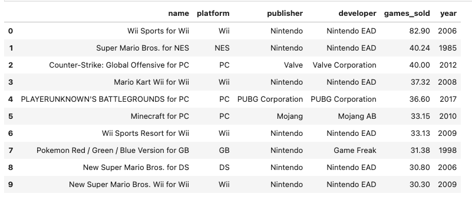
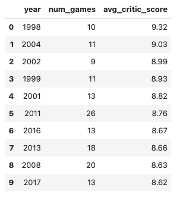
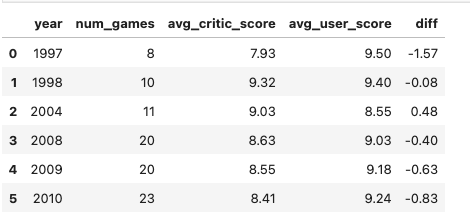
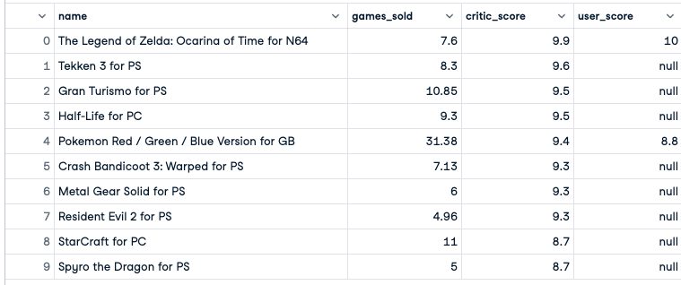

# Golden-Era-of-Video-Games
 
In this beginner datacamp project, we had to analyze video game critic and user scores as well as sales data for the top 400 video games released since 1977. The objective was to search for a golden age of video games by identifying release years that users and critics liked best

# Findings
---

## Top 10 best selling games
Wii Sports was the top game, selling almost double the copies of the next best.
We also notice that 7 out of the top 10 games sold are published by Nintendo. The popularity of their hand held consoles and the Wii console could be a contributing factor.
It is also noticeable that no Xbox or Playstation games are listed here. 

## Top 10 years with most criticically aclaimed games

## Top years with high average critic and user ratings
There were only 6 years where either the average critic scores or the average user ratings were higher than 9. Of these the year, 1998 had both critic and user ratings of above 9.
2008 to 2010 seems to be the best years for games, with more than 20 games in each year having an average rating of 9 from users or critics.

## What happened in 1998
1998 had 7 games with a critic score of above 9.
The user scores are skewed because data is available only for 2 games
The Legend of Zelda: Ocarina of Time for N64 was the best rated game with a critic rating of 9.9 and Pokemon Red / Green / Blue Version for GB was the highest selling game that year
Both published by Nintedo

